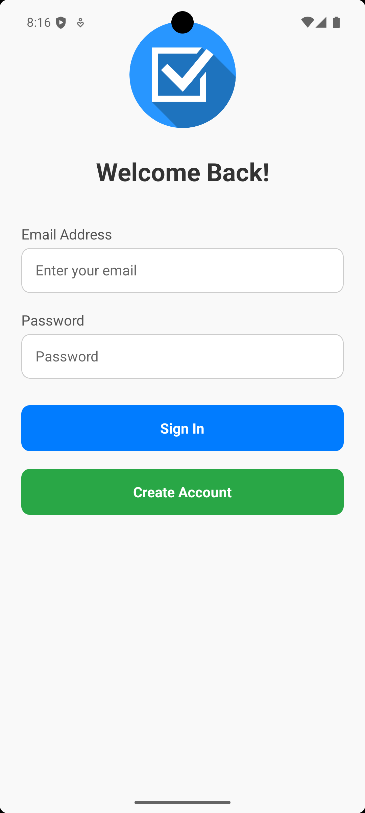
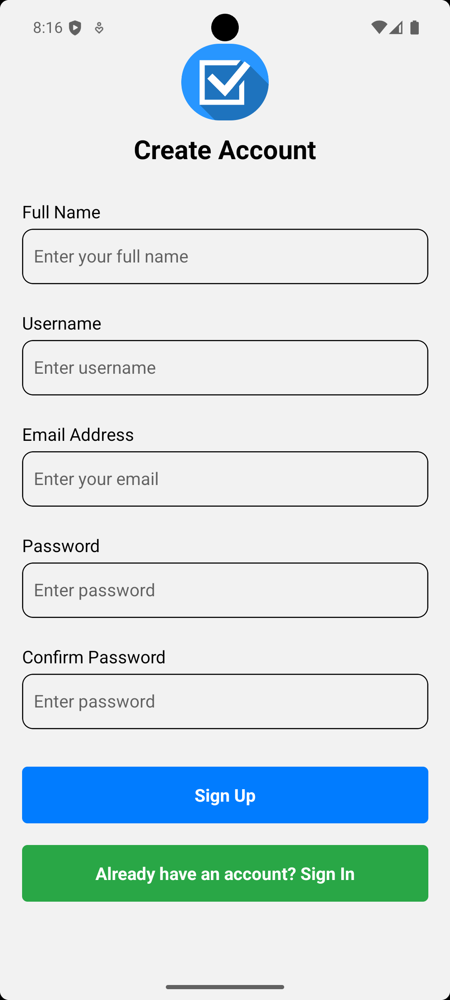
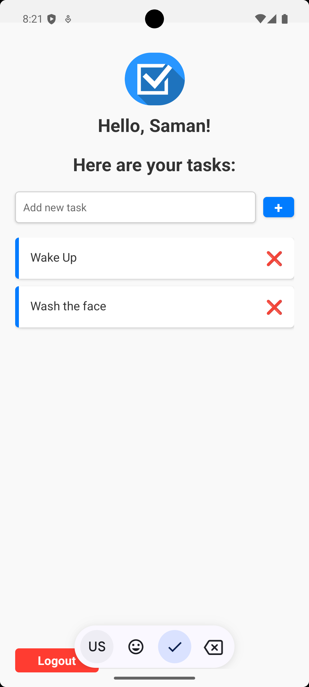

# 📝 Taskify

**Taskify** is a simple and intuitive React Native To-Do app that helps users manage their tasks efficiently. With features like adding, editing, and deleting tasks, Taskify ensures you stay organized.

**New:** Taskify now includes a Java backend for persistent task management, user authentication, and syncing tasks across devices.

---

## 🚀 Features

- ✅ Add, edit, and delete tasks.
- 📋 Mark tasks as completed or pending.
- 🔒 User authentication.
- 💾 Persistent task storage using `AsyncStorage` (local) and Java backend (remote).
- 🌐 Sync tasks between devices via backend.
- 🎨 Clean and responsive UI.

---

## 📸 Screenshots

|  |  |  |
|:----------------------:|:--------------------------:|:-------------------------:|
| Login Screen           | Task List                  | Add Task                  |

---

## 🛠️ Tech Stack

- **React Native**: Mobile app development.
- **TypeScript**: Type safety and better development experience.
- **AsyncStorage**: Local data storage.
- **React Navigation**: Screen navigation.
- **react-native-alert-notification**: Toast notifications.
- **KeyboardAwareScrollView**: Keyboard interactions.
- **Java Spring Boot**: RESTful backend API for authentication and task management.
- **ngrok**: Exposes local backend server to the internet for mobile app access.

---

## 🧑‍💻 How to Run the Project

Below are instructions for running both the frontend (React Native) and backend (Java Spring Boot) with ngrok integration.

### 1️⃣ Prerequisites

- Install [Node.js](https://nodejs.org/) (v16 or higher).
- Install [Expo CLI](https://docs.expo.dev/get-started/installation/):

  ```bash
  npm install -g expo-cli
  ```

- Install [Java JDK](https://adoptium.net/) (v17 or higher).
- Install [ngrok](https://ngrok.com/download) (for exposing backend).
- Emulator or physical device with Expo Go app.

---

### 2️⃣ Clone the Repository

```bash
git clone https://github.com/Achintha-999/taskify.git
cd taskify
```

---

### 3️⃣ Install Frontend Dependencies

```bash
npm install
```

---

### 4️⃣ Setup & Run the Backend

1. Go to the backend directory (e.g., `backend/` or as per your repo structure):

    ```bash
    cd backend
    ```

2. Build and run the Spring Boot server:

    ```bash
    ./mvnw spring-boot:run
    ```

    The backend will typically run at `http://localhost:8080`.

---

### 5️⃣ Expose Backend Using ngrok

1. In a new terminal, run:

    ```bash
    ngrok http 8080
    ```

2. Note the generated `https://<random>.ngrok.io` URL.

3. Update your React Native app to use this URL for API requests.  
   Example: In your API service/config file, set the base URL:

    ```typescript
    const BASE_URL = 'https://<random>.ngrok.io/api';
    ```

---

### 6️⃣ Start the Frontend

```bash
npm start
```

This will open Expo Developer Tools. Scan the QR code with Expo Go or run on an emulator.

---

## 📡 How to Use Backend Integration

- **Sign In / Sign Up:** Credentials are sent to the backend via REST API (`/api/auth/login`, `/api/auth/register`).
- **Task Management:** All task data (add, edit, delete, mark complete) are sent to the backend (`/api/tasks`), which persists them for each user.
- **Syncing:** When you sign in, tasks are fetched from the backend and synced to your device.
- **Offline Storage:** Local changes are cached with AsyncStorage and synced when online.

### Example: Sending Request to Backend

```typescript
// Example using fetch in React Native
fetch('https://<random>.ngrok.io/api/tasks', {
  method: 'POST',
  headers: {
    'Content-Type': 'application/json',
    'Authorization': 'Bearer <user_token>'
  },
  body: JSON.stringify({ title: 'New Task', completed: false })
})
.then(res => res.json())
.then(data => { /* handle response */ });
```

---

## 🏃‍♂️ How It Works

### Sign In

- Enter your email and password to log in.
- If the credentials are valid, you're redirected to the task list screen.

### Task Management

- Add, edit, delete tasks; changes are sent to backend for persistence.
- Mark tasks as completed by tapping on them.
- Delete tasks by pressing the delete icon.

### Persistent Storage & Sync

- Tasks are saved locally using AsyncStorage and remotely via the Java backend.
- On sign-in, tasks sync from backend to device.

### Logout

- Press the logout button to return to the sign-in screen.

---

## 📂 Project Structure

```
Taskify/
├── src/
│   ├── screens/
│   │   ├── SignInScreen.tsx
│   │   ├── SignUpScreen.tsx
│   │   ├── TaskListScreen.tsx
│   ├── components/
│   ├── assets/
│   │   └── logo.png
│   ├── App.tsx
├── backend/
│   ├── src/
│   │   └── main/
│   │       └── java/
│   │           └── ... (Java backend code)
│   ├── pom.xml
│   └── README.md
├── .gitignore
├── package.json
├── README.md
```

---

## 🌟 Features in Progress

- 🔔 Push notifications for task reminders.
- 🌐 Full backend integration for syncing tasks across devices.
- 🎨 Dark mode support.

---

## 🤝 Contributing

Contributions are welcome! If you'd like to contribute to Taskify, please follow these steps:

1. Fork the repository.
2. Create a new branch:

   ```bash
   git checkout -b feature-name
   ```

3. Make your changes and commit them:

   ```bash
   git commit -m "Add feature-name"
   ```

4. Push to your forked repository:

   ```bash
   git push origin feature-name
   ```

5. Open a pull request.

---

## 📜 License

This project is licensed under the MIT License.

---

## 🙌 Acknowledgments

Thanks to the React Native & Java Spring Boot communities for amazing tools and libraries.  
Icons by FontAwesome.
